<h1 align="center">  </h1>  

  

   
      

## Introduction
Citadel is a collection of various scripts for pentest-related tasks.

## List of scripts included
- [vars.zsh](#vars.zsh)
- [msf\_resource\_scripts](#msf_resource_scripts)
- [dnsdump.py](#dnsdump.py)
- [fileinfo.zsh](#fileinfo.zsh)
- [fileserver.py](#fileserver.py)
- [opcodes.zsh](#opcodes.zsh)
- [stackpush.zsh](#stackpush.zsh)
- [ssl_convert.zsh](#ssl_convert.zsh)
- [gitdownload.zsh](#gitdownload.zsh)
- [cardmon.zsh](#cardmon.zsh)
- [powershell\_cmd\_stager.py](#powershell_cmd_stager.py)
- [sf_parser.py](#sf_parser.py)
- [xml\_to_json.py](#xml_to_json.py)
- [enum_forms.py](#enum_forms.py)
- [linker.sh](#linker.sh)
- [init_commit.sh](#init_commit.sh)
- [shellstorm.py](#shellstorm.py)

## vars.zsh

  <a>
    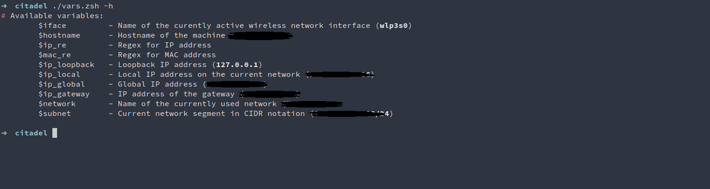
  </a>

Exports useful networking variables that can be used directly in terminal. 

## msf\_resource\_scripts

  <a>
    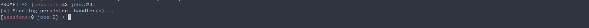
  </a>

This directory contains a few `.rc` files for Metasploit Framework Console that automate certain tasks in the CLI. In order for them to work properly, put all scripts from this directory into your default path containing resource scripts for the framework, then load the main file: `msf5> resource main.rc`.  

## sf_parser.py

  <a>
    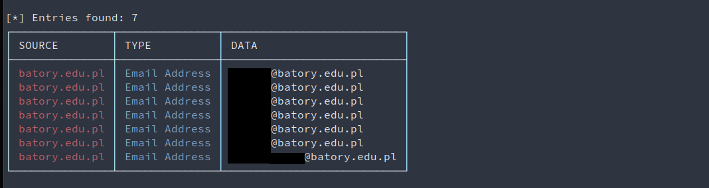
  </a>

Pretty-print results of a SpiderFoot scan

## dnsdump.py

  <a>
    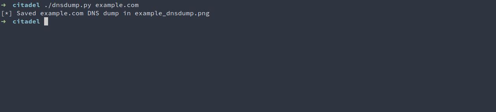
  </a>

Downloads an image representation of DNS graph from [dnsdump.com](http://dnsdump.com).

## fileinfo.zsh

  

Presents basic information about selected file.  

## fileserver.py

  <a>
    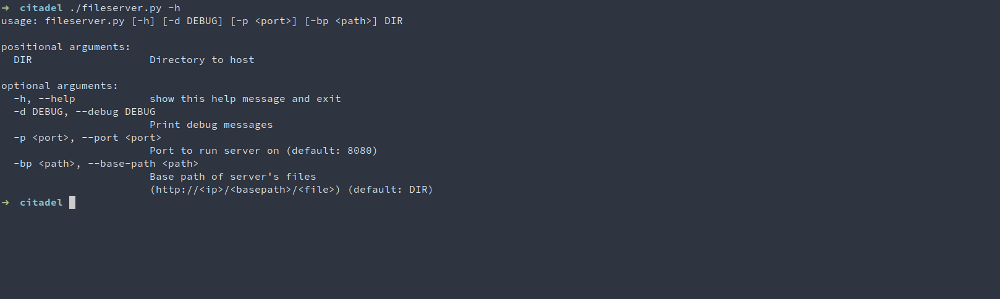
  </a>

Simple file server that exposes a local directory.

## opcodes.zsh

  <a>
    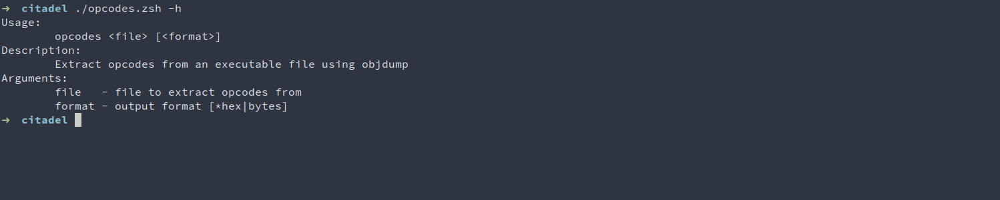
  </a>

Extracts opcodes from a binary, and prints them to STDOUT. Useful in shellcode development.

## stackpush.zsh

  <a>
    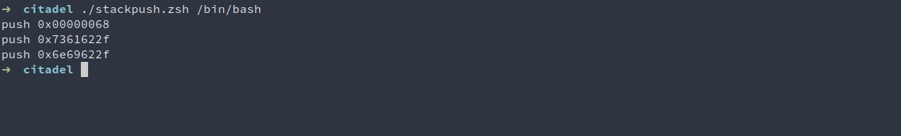
  </a>

Generates assembly instructions that push desired string onto the stack.

## ssl_convert.zsh

  <a>
    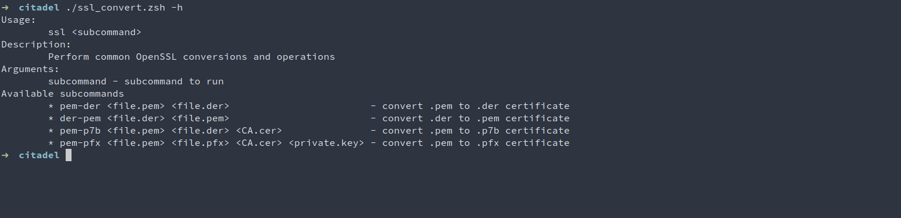
  </a>

Performs common OpenSSL file conversions.

## gitdownload.zsh

  

Downloads a single file from a Github repository.

## cardmon.zsh

  <a>
    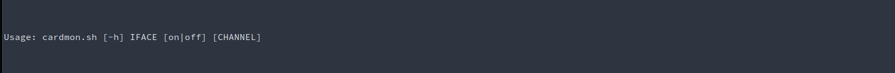
  </a>

Quickly switch between modes of a network interface.

## powershell\_cmd_stager.py

  <a>
    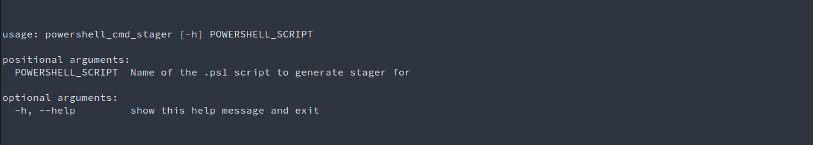
  </a>

Creates a command stager that will execute provided Powershell script

## xml\_to_json.py

  <a>
    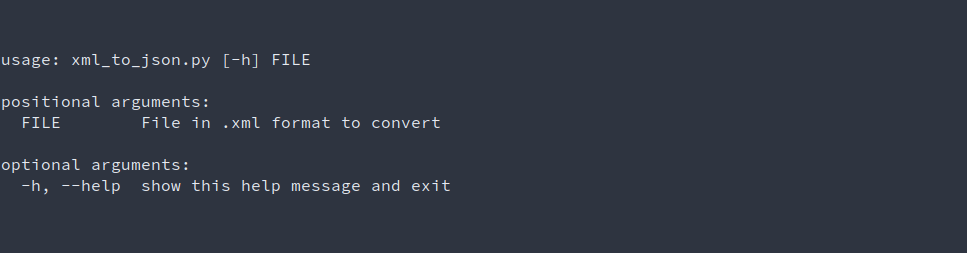
  </a>

Converts a .xml file to JSON

## enum_forms.py

  <a>
    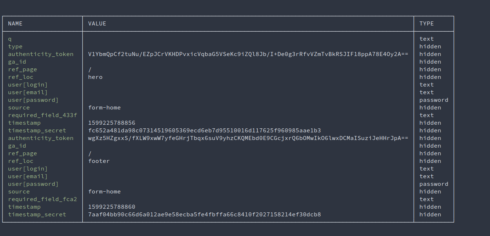
  </a>

Scrapes forms from URL

## linker.sh
Creates symbolic links under '.' for all executables found in given directory

## init_commit.sh
Creates a .git repository and pushes all files to remote

## shellstorm.py

  <a>
    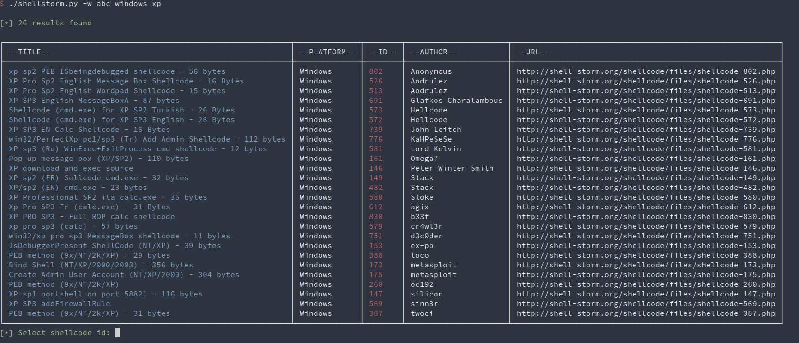
  </a>

Searches for shellcodes using Shellstorm API. You can extract raw bytes of the shellcode and write it to a file

## License
This software is under [MIT License](https://en.wikipedia.org/wiki/MIT_License)

